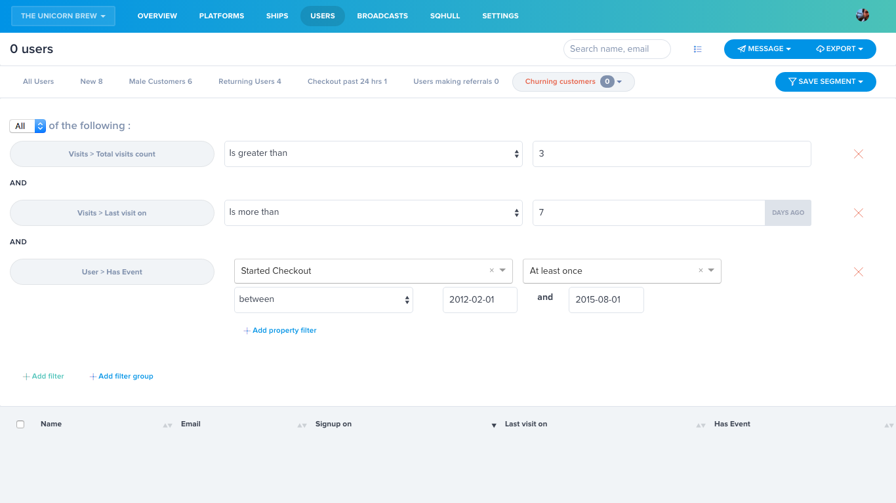
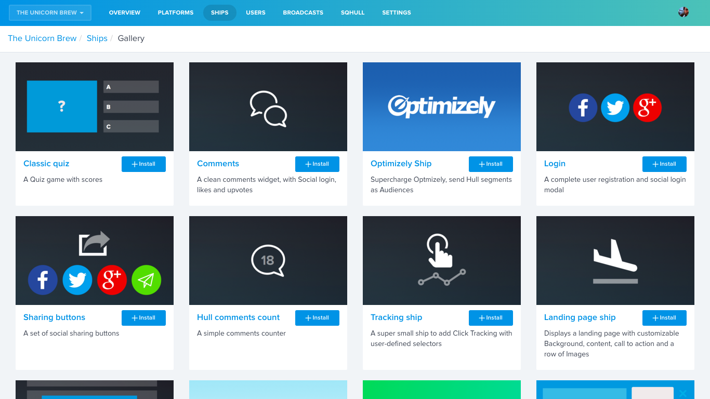
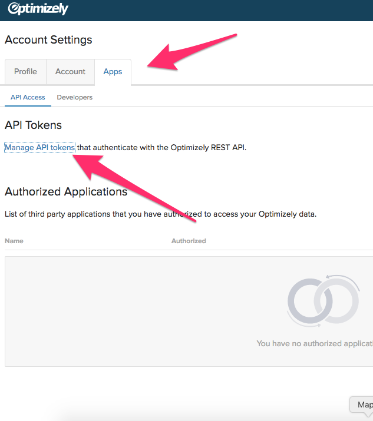
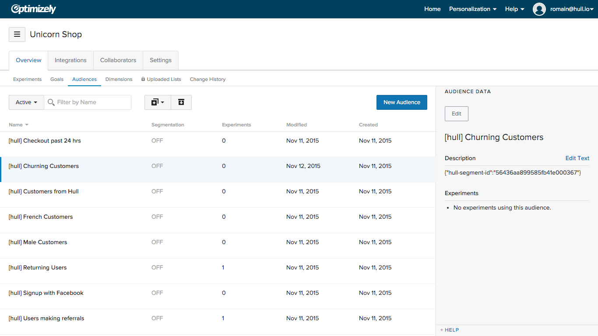
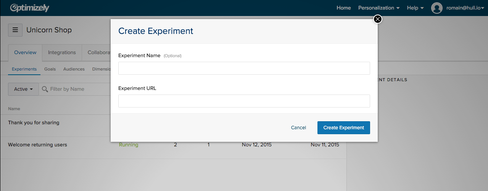
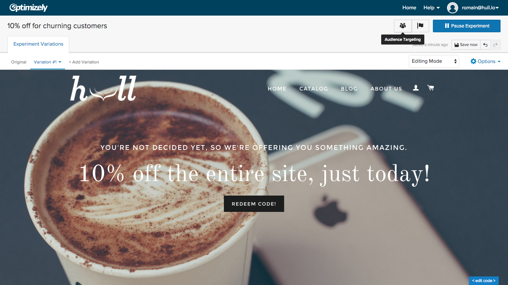
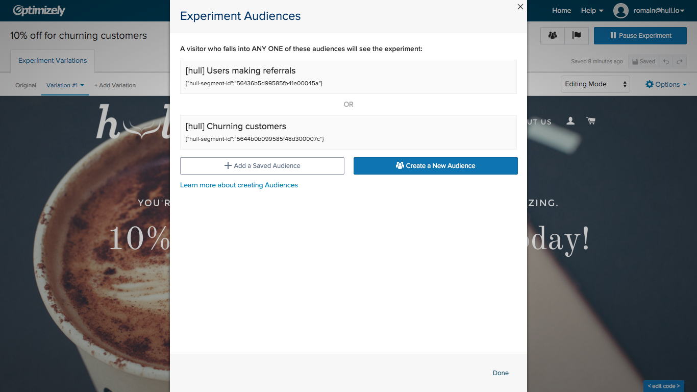
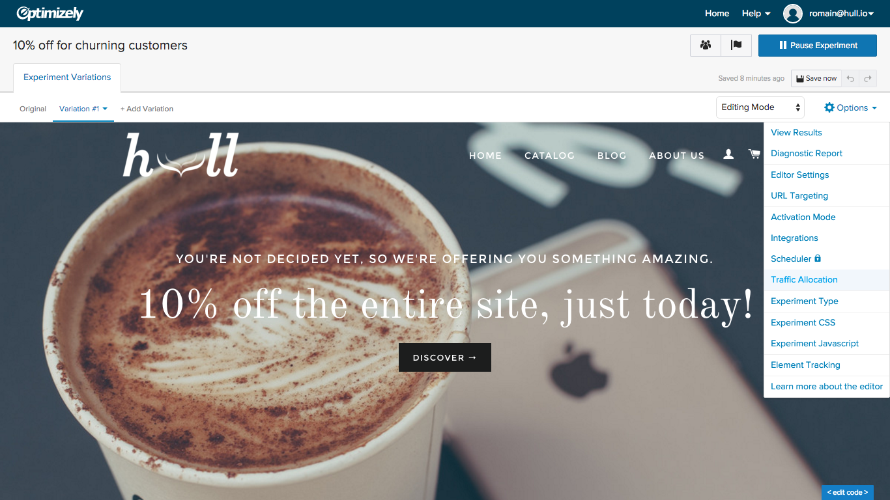
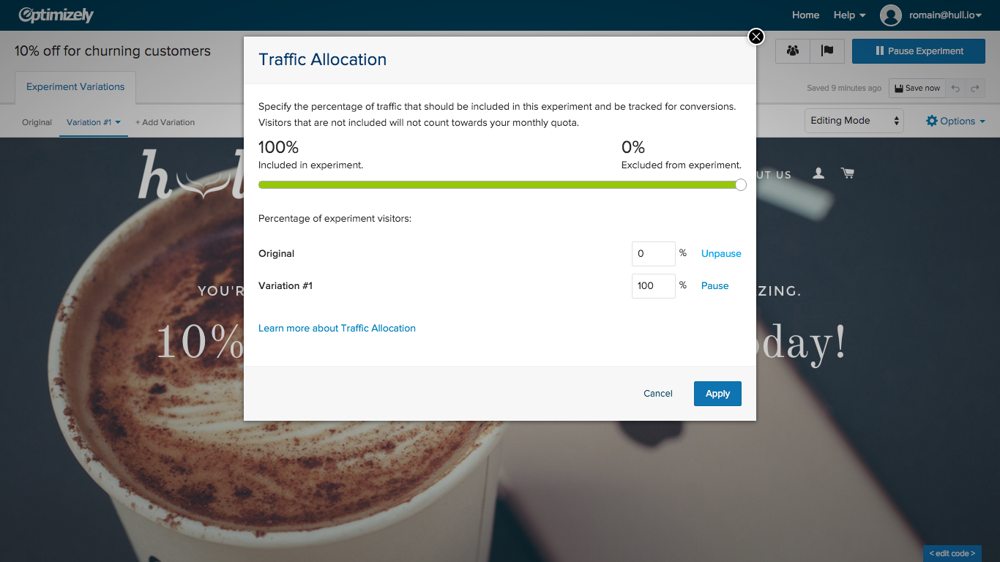

# Hull Optimizely Ship

[Visit Optimizely website](http://optimizely.com)

__The Optimizely Ship allows you to sync your Hull Segments as Optimizely Audiences in real-time. You need a Platform with Hull.js installed to make this work__

When a user matches a segment you created in Hull using properties and events, he will be added immediately to a matching Optimizely Audience, allowing you to create experiments and customize pages in real-time.

### Instant Personalization with Optimizely and Hull

_More and more, customers expect brands to understand their current situation, and adapt to their needs. In this tutorial, we'll look at the case of customers who already have bought once something from you but aren't anymore. They keep coming back and looking at some product on your website, but don't make a purchasing decision. Obviously they're interested in something but they need a little help._

_Let's give them a little nudge, by offering a 10% off coupon._

#### First, create your segment in Hull.
A good way to name your segments is to describe "who they are", instead of "what you want to do with them". Who they are doesn't change between tools, what you might want to do with them does.
- Good: `Churning customers`
- Bad: `10% off`

###### Let's define a churning customer:

- Has visited the site at least 3 times this month
- and has already made at least $200 worth of purchases in the past 6 month.
- and has not made any purchase for more than 1 month.

#### Install the Optimizely ship (if it's not done already).

### Inserting Optimizely's Credentials into Hull

Once you've installed the connector, you must copy the correct API key. You can locate it by logging into your Optimizely account and going to your account settings in the top right corner.Then go to Apps and click the "Manage API Tokens" hyperlink. 

Copy the API key and then go back to the connector in Hull where you can then paste it to the empty API Key field. If there isn't an API token already there you will have to hit "Generate" on the right hand side of the same page. 

You'll then need your Project ID which can be found from the home screen by clicking "Settings" and copying the respective project ID. 

Paste the Project ID on the same screen as the API key and hit save in the top right corner.

After a few minutes, you should see all your customer segments from Hull replicated as Optimizely Audiences

#### Now, go to Optimizely, create a new Experiment
In this experiment, edit the page to welcome the user with a link to redeem a coupon.  Name it `10% off for churning customers`

Create your variation, customize everything you need to change for this specific audience.

#### Target the experiment only to a specific audience
On the top right, click "Audience Targeting" and select the `Churning Customers`
audience

#### Send all audience traffic to this experiment.
By default, Optimizely splits your audience's traffic between the different variations you created and the Original version. Here you don't want this, you want to send everyone in your selected audience to the created variation.

Click `Options` > `Traffic Allocation` and make sure your new variation gets 100% of the trafic

### You're Done.

That's it. Nothing else to do, your realtime personalization is now in place!
